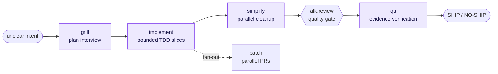

# The AFK Flow

afk's four-step flow takes you from unclear intent to a verified, shipped
change. Each skill works standalone — run them in sequence for a feature, grab
one on its own, or use `/afk:ship` to drive the whole loop automatically.

::: tip The whole loop, hands-free
`/afk:ship` drives every box above to a verdict — planning when needed,
simplifying when useful, and calling [reflect](/reference/reflect) at the end to
persist learnings back to the brain.
:::

## grill

[grill](/reference/grill) interviews you about the plan one decision at a time.
It reads the codebase, your domain glossary (`CONTEXT.md`), ADRs, and the
brain's principles before asking anything, so it only asks questions the repo
cannot answer. It stress-tests decisions with concrete scenarios, edge cases,
and failure modes, then writes the agreed plan to `brain/plans/<slug>.md` (or
`docs/plans/<slug>.md` when no vault exists). That plan is the input to
implement.

## implement

[implement](/reference/implement) is the gate before any file editing. It
triages complexity: genuinely test-free work (docs, config, a literal one-liner)
stays in the main conversation; everything else routes through the
[implement-orchestrator](/reference/implement) — a read-only Opus agent that
decides architecture, contracts, and slice boundaries — which then fans the work
out to bounded Sonnet [implementation-worker](/reference/implement) agents
running local TDD slices. Each worker writes the failing test first, makes the
smallest passing change, and reports evidence.

## simplify

[simplify](/reference/simplify) runs four independent cleanup agents in
parallel, each reviewing the diff from one angle: reuse, simplification,
efficiency, and altitude. It deduplicates their findings and applies only fixes
that preserve intended behavior. This is not a correctness review — it improves
quality without hunting for bugs.

## qa

[qa](/reference/qa) proves whether the intended user or client can complete the
changed flow. It routes by project shape: browser QA with direct screenshots
and console checks for frontend, contract-level API or CLI verification for
backend, both for hybrids. It ends with a SHIP, DO NOT SHIP, or SHIP WITH
CAVEATS verdict backed by direct evidence — not just "tests pass".

## batch

[batch](/reference/batch) is the fan-out alternative to implement for plans
that split into many independently-mergeable units. It runs one parallel
worktree worker per unit, each opening its own PR. Use batch when you want
parallel PRs rather than a single integrated change.

## ship

[ship](/reference/ship) drives the whole loop to a verdict. It plans when
needed, implements, simplifies when useful, runs [afk:review](/reference/review)
as a quality gate between simplify and qa, QA-checks behavior, and ends with a
ship/no-ship decision. Ship also calls [reflect](/reference/reflect) at the end
to persist session learnings back to the brain vault.
