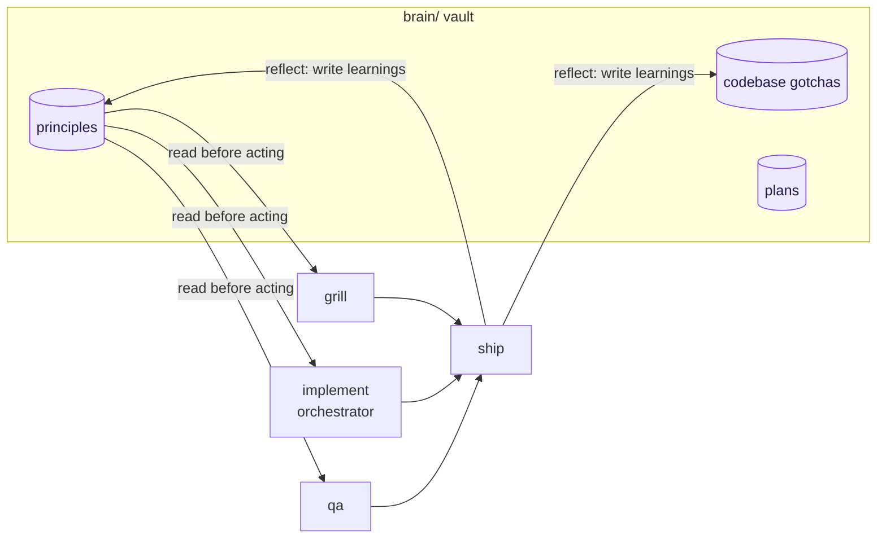

# The Brain Vault

afk keeps a persistent `brain/` vault — an Obsidian-compatible markdown store
of your project's engineering principles, codebase gotchas, and decisions. The
vault accumulates knowledge across sessions so the flow gets better over time
rather than starting fresh each time.

## Structure

```
brain/
├── index.md          ← root entry point, links to everything (auto-built)
├── principles.md     ← index for principles/
├── principles/       ← engineering and design principles
├── codebase/         ← project-specific knowledge and gotchas
├── sources.md        ← index for sources/ (when doc sites exist)
├── sources/          ← pointers to external authoritative docs
└── plans/            ← feature plans from afk:grill and afk:plan
```

One topic per file. The vault is Obsidian-compatible: wikilinks
(`[[section/file-name]]`) connect notes, and `brain/index.md` is the root
entry point the session hook injects.

::: principle One topic per file
Each note holds a single principle or gotcha. Small, well-named files let the
flow inject exactly what's relevant instead of dragging in a monolithic memory
doc — and keep the auto-built index readable.
:::

::: gotcha Don't hand-edit the index
`brain/index.md` is regenerated by the PostToolUse hook on every `brain/` write.
Edit the source notes, not the index — your changes there will be overwritten.
:::

## The two hooks

Two hooks run the vault plumbing automatically:

- **SessionStart** (`inject-brain.sh`) — injects `brain/index.md` at the start
  of every Claude Code session so every session knows what principles and
  knowledge the vault holds.
- **PostToolUse** (`auto-index-brain.sh`) — rebuilds `brain/index.md` whenever
  a file inside `brain/` is written or deleted, keeping the index always
  current without manual maintenance.

## How the flow reads and writes it



The flow is wired to the vault at both ends:

- **grill**, the **implement orchestrator**, and **qa** read `brain/principles.md`
  and its linked principle files before acting, grounding plans and reviews in
  your project's accumulated decisions.
- **ship** calls [reflect](/reference/reflect) after a run, which scans the
  session for durable learnings — mistakes, corrections, codebase gotchas,
  tool quirks — and writes them back to the vault so future sessions benefit.

## Brain skills

| Skill | What it does |
|---|---|
| [init-brain](/reference/init-brain) | Scaffold the vault in a project (also created on demand) |
| [brain](/reference/brain) | Read or write the vault directly |
| [reflect](/reference/reflect) | Capture this session's learnings into the brain |
| [ruminate](/reference/ruminate) | Mine past Claude Code conversations for patterns reflect missed |
| [meditate](/reference/meditate) | Audit and prune the vault; distill cross-cutting principles |
| [plan](/reference/plan) | Break a medium-to-large task into phased, principle-grounded plans under `brain/plans/` |
| [review](/reference/review) | Principle-grounded review of code or plans, ending in a verdict |

## Credits

The brain skills and hooks are derived from
[brainmaxxing](https://github.com/poteto/brainmaxxing) by Lauren Tan (MIT),
rewritten to afk's skill conventions.
